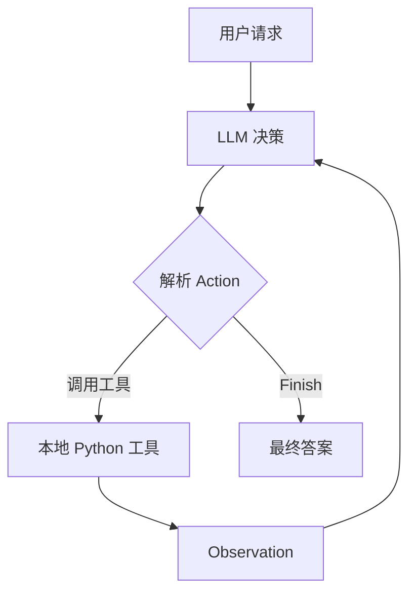

# Agent Practice

一个面向智能体开发入门的 Python 学习项目。

本仓库从最基础的实现出发，不依赖 LangChain、LlamaIndex 等 Agent 框架，直接使用 Python 手动搭建一个能够调用天气查询和网络搜索工具的智能旅行助手，用于理解 LLM、工具、记忆与 Agent 控制循环之间的关系。

## 项目目标

通过一个“查询天气并推荐旅游景点”的任务，理解简单智能体的核心组成：

- LLM 负责理解请求并决定下一步行动；
- System Prompt 规定智能体的身份、任务、工具和输出协议；
- Python 本地程序负责解析并执行 LLM 选择的工具；
- 外部 API 为智能体提供实时天气和网络搜索能力；
- Observation 将工具执行结果反馈给 LLM；
- Agent Loop 重复上述过程，直到模型输出最终答案。

## 智能体与普通 LLM 调用的区别

普通 LLM 调用通常只包含一次“输入 → 输出”：

```text
用户问题 → LLM → 文本回答
```

本项目中的智能体会让 LLM 与外部工具进行多轮交互：



因此，LLM 本身并不会直接执行 Python 函数。它只输出希望执行的 `Action`，真正的函数调用由本地 Python 程序完成。

## 当前实现

| 文件 | 内容 |
| --- | --- |
| `01-简单智能体搭建.py` | 实现 System Prompt、天气工具、景点搜索工具、OpenAI 兼容客户端、Action 解析和 Agent 主循环 |

### 可用工具

#### `get_weather(city)`

通过 `requests` 请求 `wttr.in`，获取指定城市的实时天气 JSON 数据，并提取：

- 天气描述；
- 当前摄氏温度。

#### `get_attraction(city, weather)`

通过 Tavily Search API 根据城市和天气搜索景点推荐。请求开启 `include_answer=True` 时，优先返回 Tavily 整理后的综合答案；如果没有综合答案，则整理原始搜索结果。

## Agent 运行流程

程序使用一种简化的 ReAct 风格协议，让模型每轮输出一组 `Thought` 和 `Action`：

```text
Thought: 分析当前信息并决定下一步
Action: get_weather(city="北京")
```

工具执行完成后，Python 将结果记录为：

```text
Observation: 北京当前天气：Cloudy，气温32摄氏度
```

下一轮调用时，Observation 会加入提示词，LLM 根据新信息继续决定行动：

```text
Thought: 已获得天气，需要根据天气查询景点
Action: get_attraction(city="北京", weather="Cloudy")
```

信息足够后，模型使用以下格式结束任务：

```text
Action: Finish[最终回答]
```

主循环最多执行 5 次，用于避免模型不断调用工具而无法结束：

```python
for i in range(5):
    ...
```

## 核心代码机制

### 1. System Prompt

System Prompt 是调用 LLM 时预先提供的一组全局指令，用于规定模型的身份、任务目标、行为规则、可用工具和输出格式。

本项目通过 `AGENT_SYSTEM_PROMPT` 将模型设置为智能旅行助手，并要求它严格输出：

```text
Thought: ...
Action: ...
```

### 2. OpenAI 兼容客户端

`OpenAICompatibleClient` 对 OpenAI Python SDK 进行简单封装：

```python
llm = OpenAICompatibleClient(
    model=MODEL_ID,
    api_key=API_KEY,
    base_url=BASE_URL,
)
```

其中：

- `model`：服务商提供的模型名称；
- `api_key`：访问模型服务的身份凭证；
- `base_url`：模型服务的 API 地址。

只要服务商提供 OpenAI 兼容接口，就可以继续使用相同的客户端结构，不局限于某一个模型服务商。

### 3. 工具注册表

所有允许模型调用的函数都放入 `available_tools`：

```python
available_tools = {
    "get_weather": get_weather,
    "get_attraction": get_attraction,
}
```

它既是工具名称到 Python 函数的映射，也是一份工具白名单。只有出现在字典中的工具才会被执行。

### 4. Action 解析

程序使用正则表达式提取模型输出中的 Action：

```python
action_match = re.search(r"Action: (.*)", llm_output, re.DOTALL)
```

然后继续提取工具名称和参数：

```python
tool_name = re.search(r"(\w+)\(", action_str).group(1)
args_str = re.search(r"\((.*)\)", action_str).group(1)
kwargs = dict(re.findall(r'(\w+)="([^"]*)"', args_str))
```

例如：

```text
get_weather(city="北京")
```

会被解析成：

```python
tool_name = "get_weather"
kwargs = {"city": "北京"}
```

### 5. 动态调用本地函数

解析完成后，通过字典找到函数并传入参数：

```python
observation = available_tools[tool_name](**kwargs)
```

它等价于：

```python
observation = get_weather(city="北京")
```

其中 `**kwargs` 用于把字典拆成关键字参数。

### 6. Prompt History

程序使用列表保存用户请求和工具执行结果：

```python
prompt_history = [f"用户请求: {user_prompt}"]
```

每次调用 LLM 前，将历史信息拼接成完整提示词：

```python
full_prompt = "\n".join(prompt_history)
```

工具执行完成后追加 Observation：

```python
prompt_history.append(observation_str)
```

这构成了当前智能体最基础的短期记忆。

## 环境准备

建议使用 Python 3，并在虚拟环境中运行。

安装依赖：

```bash
pip install requests tavily-python openai python-dotenv
```

依赖用途：

| 依赖 | 用途 |
| --- | --- |
| `requests` | 发送 HTTP 请求，访问天气 API |
| `tavily-python` | 调用 Tavily Search API |
| `openai` | 调用 OpenAI 兼容的 LLM 服务 |
| `python-dotenv` | 从 `.env` 文件加载 API 配置 |

## 配置环境变量

在 Python 文件同一目录创建 `.env`：

```env
LLM_API_KEY=你的LLM服务API密钥
LLM_BASE_URL=你的LLM服务API地址
LLM_MODEL=你的模型名称
TAVILY_API_KEY=你的Tavily密钥
```

程序通过以下代码加载：

```python
env_path = ".env"
load_dotenv(env_path)
```

然后从当前 Python 进程的环境变量中读取：

```python
API_KEY = os.environ.get("LLM_API_KEY")
BASE_URL = os.environ.get("LLM_BASE_URL")
MODEL_ID = os.environ.get("LLM_MODEL")
TAVILY_API_KEY = os.environ.get("TAVILY_API_KEY")
```

建议同时创建 `.gitignore`：

```gitignore
.env
__pycache__/
*.pyc
```

不要把真实 API Key 写进 Python 源码，也不要将 `.env` 上传到 GitHub。

## 运行项目

```bash
python "01-简单智能体搭建.py"
```

当前脚本包含两个运行阶段：

1. 直接调用天气和景点工具，测试工具是否可用；
2. 启动 Agent 主循环，完成“查询北京天气并推荐景点”的任务。

终端会依次显示：

- 当前用户请求；
- 每轮拼接后的提示词；
- LLM 输出的 Thought 和 Action；
- Python 实际调用的工具及参数；
- 工具返回的 Observation；
- 最终回答。

## 当前学习到的知识点

| 知识点 | 对应实现 |
| --- | --- |
| HTTP 请求与 JSON 解析 | `requests.get()`、`response.json()` |
| 第三方 API 调用 | wttr.in、Tavily Search API |
| API Key 管理 | `.env`、`load_dotenv()`、`os.environ.get()` |
| LLM 消息结构 | `system` 和 `user` 两种消息角色 |
| OpenAI 兼容接口 | `OpenAI(api_key, base_url)` |
| System Prompt | 定义身份、任务、工具和输出协议 |
| ReAct 基本结构 | `Thought → Action → Observation` |
| 正则表达式 | `re.search()`、`re.match()`、`re.findall()` |
| 工具白名单 | `available_tools` 字典 |
| 动态函数调用 | `available_tools[tool_name](**kwargs)` |
| 短期记忆 | `prompt_history` |
| Agent 控制循环 | 最多执行 5 轮的 `for` 循环 |
| 异常处理 | 网络、数据解析和 API 调用异常 |

## 代码中各部分的职责

```text
AGENT_SYSTEM_PROMPT
    规定智能体如何工作

OpenAICompatibleClient
    负责向 LLM 服务发送请求

get_weather / get_attraction
    负责访问外部环境并获取信息

available_tools
    注册并限制允许调用的工具

正则表达式
    将模型输出的 Action 转换成工具名和参数

Agent 主循环
    组织“决策 → 执行 → 观察 → 再决策”的完整过程
```

## 当前实现的注意事项

这是一个用于理解 Agent 原理的学习性实现。后续可以继续改进：

- 将 `.env` 的加载移动到所有 API 调用之前；
- 为天气请求增加 `timeout` 和失败重试；
- 检查 LLM 是否返回空字符串或 `None`；
- 对工具参数和 `Finish[...]` 格式增加更完整的解析保护；
- 使用结构化 Tool Calling 替代纯正则表达式解析；
- 将配置、工具、LLM 客户端和 Agent 控制器拆分成独立模块；
- 增加日志、单元测试以及交互式用户输入。

## 项目定位

这个项目的重点不是实现一个功能复杂的旅行应用，而是从代码层面理解智能体的本质：

> LLM 负责根据目标和已有信息作出决策，工具负责与外部环境交互，本地控制程序负责约束、执行并反馈结果。

通过手动完成这条执行链路，可以为后续学习 Function Calling、MCP、Agent 框架、多智能体协作和长期记忆打下基础。
